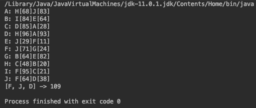

# Weighted-Graph
Creates a random graph with edges and vertices and calculates the shortest path between a starting point and end point.

## Preview
  
Here it takes <b>F</b> as a starting point and <b>D</b> as an end point.
